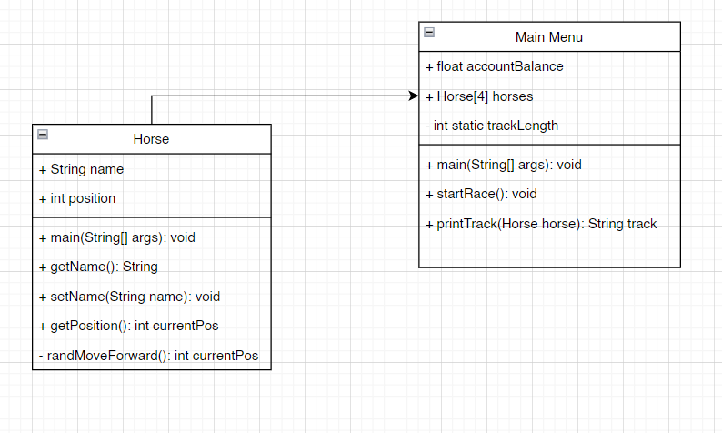

FRC 3559 Intro to Programming
Edwin Sanchez
# Horse Race Project (Object-Oriented Programming Introduction)
The goal of this project is to learn a little bit about Object-Oriented-Programming: How to make objects, how to use them, and most importantly, *why* we use them.

We will also look at how to use project management tools in order to help facilitate the design of our code/program.

## Project Management Tools
There are many tools that you may use to do project management. Some, but not all, include:
* **Guiding Document:** this is the document you write in order to declare the programing goals and any other details you might want to specify. If you ever get lost, you can come back to this document and double-check if your code matches the end goal you wanted.
* **Class Diagrams:** used to design classes for object-oriented code.
* **Flow Charts:** can help to visualize how your program transitions between its many states.
* **UI Diagramming/Mapping:** used to draw out the UI for a given program to help understand how the user may interact with the system and give an insight into how one might design some of the functionality of the code.

For this project, we will use the **Guiding Document**, **UI Diagramming**, and **Class Diagrams**.

### Guiding Document
Normally, for smaller projects, my `README.md` is the document I use as my guiding document. We will write out our guiding document below. Here are a few things you may want to add to your guiding documents in future projects:

* **Project Title/Name:** Don't mistake the power of a good name. This can help you to summarize your project in a single word or phrase, which is powerful when it comes to setting up a good mindset to work on a project.

* **Goals:** what is the goal of your project? Write this out explicitly so that you know exactly what your goal is. You should be able to summarize your project's goal in about a paragraph.

Often times people get stuck in projects because they do a poor job setting their goal. Without having an explicit goal, it's hard to measure whether or not you are succeeding, which can be de-motivating. It also makes it hard to know if that anything you are working on is really helping you reach your end goal. Many people get caught up in little details - **avoid trying to make an everything project**. Projects that try to do everything will end up doing nothing.

* **Requirements:** This can be nice if your program needs to have very specific requirements that aren't quite worth mentioning directly in your goal. For instance, you may be developing a texting app. While your goal is to facilitate communication through your app, you may have a requirement for your app to be *accessible* - meaning that maybe you design the app to allow blind people to easily use it. 

While these requirements aren't you true objective, they are things you think are crucial for your project to be able to work well. Also, remember to only add the things you need - again, avoid creating an everything project (I'm mentioning it a lot because it's a very common issue developers face).

* **Inputs:** These are what will need to go into your program. For a simple program, you may not have many of these. This could just be deciding how your user will interact with your program (ie. terminal, GUI, etc.). Other things may include files that your program depends on for working. For larger project, you may need to dedicate significant time to understanding what inputs your program will need/have.
* **Outputs:** These are what your program will output. This could be files as well as text printed to the terminal to facilitate user interaction (This sort of goes hand-in-hand with inputs).
* **Classes/Methods:** This section should contain all of the details your code will have. Any functions or Classes you will create should be written out here so that anyone who need to know how your code works can look at this and instantly understand what it does/how it should work. If you write this out before you start programming, you will have a guide to go by when you're writing code so that you don't get lost. The amount of detail you put in here will be reflected in how much difficulty you have writing your code.

Below is an example of a Guiding Document, designed around the current project:

```
Project Title: Horse Race Project

Goal:
The goal of this project is to write a terminal/command line program that allows a user to bet on a horse race. This program should:

1) Allow the user to quit the program.
2) Allow the user to see their available ballance.
3) Allow the user to start a race, pick a horse to bet on, watch the race, and then have their balance updated to reflect the results of their race and the bet.

Requirements:
- If the user inputs wrong values when navigating the menu, the program should be able to handle this.
- If the user does not have enough money to continue to bet, then they should be denied the ability to start a race.

Inputs:
The user will use the terminal to input decisions for the program. The user's inputs will be restricted to explicit options listed in menus printed to the screen.

Outputs:
The program will output menus for the user to interact with, as well as other statements depending on the selected option. During the horse race, the program will output the current state of the race for the user to see.
```

### UI Diagram
Now that we have a plan for our project, we can make a **UI Diagram** to help us visualize what our project should look like. Attached to this github repository should be a powerpoint presentation titled `FRC-ProgrammingPractice-HorseRaceVisualization.pptx`. This is an example of how to visualize Horse Race program.

#### Key Takaways:
* Notice that I try to create a visualization of every possible screen the user may see. This will help us take the idea we have in our heads and get us to something concrete. Saying *I'm going to write a Horse Race Program to allow a user to bet on horses.* doesn't always carry with it a clear picture as to how things will end up being implemented.
* This process will also help you to find issues you may have in your program before you start coding. It can also help you to figure out what variables you may need access to at different stages of your program. I need the `bankAccount` balance in the main menu, but I also need it at the end of the race. Knowing this ahead of time can save me the trouble of trying to move variables around to be available in the areas I need it to.
* One final point is that while UI visualization can help you to find problems before you go to write the code, it will only help you with the sort of problems that you can see. The code ends up having a lot more complexity when it comes to actually running the race, which can be hard to see here. There are hints to that complexity - look at how the horses move across the track. How would you do that? - but it doesn't really give you a good idea as to just how difficult that will be.

### Class Diagrams
The final software project management tool that we will use is the **Class Diagram**. This is a must-use tool for projects where you know it's a good idea to break the problem down into objects. Below is an example of one (made with [Draw.io](https://app.diagrams.net/). There are many others out there, so use what you like):



Here's some quick notes on what's going on in this picture:
* The boxes labeled `Horse` and `Main Menu` are classes. Both boxes represent a their respective classes and all functions and variables that will be needed for them to function.
* The `+` and `-` signs represent public and private variables/functions.
* There is a solid black line running horizontally through both boxes. These lines divide the *variables* (above) from the *functions* (below).
* Each variable is first designated with a *type* followed by a *name* (ex. `int` and `position` for the **Horse** class).
* Each function is designated with a *name*, any *inputs* in parentheses (and their types) followed by a *return value*.
* We can also describe the relationships between different classes by using arrows and lines. In the diagram above, the part of the `Main Menu` class is *composed* of an array of the `Horse` class. This means that our `Main Menu` class will be utilizing our `Horse` class in order to do some of its tasks.

The picture above is the class diagram I made for this project *before* I wrote the code. There's a reason I make this distinction. There's a very high likelihood that you will need to modify your class diagram as you program as you come across issues that you didn't see before hand. This will happen less and less as you go on, but it is impossible to know all of the issues you will face until you get to them. Making the class diagram, however, will give you an upper hand as writing it requires you to walk through the process you plan on having to make your program, exposing you to the flaws you may have in your logic.

For practice, take the finished code in this repository and create a new Class Diagram for it. It will have some similarities to the image above, but it will have more detail as the program's complexity was revealed while coding and more functions were needed to abstract away concepts.

## Assignment 3
For this assignment, do the following:

1. Write a new **Class Diagram** for the finished code. What differences can you find between the one that was written *before* the code was finished and the one you made for the finsihed code? Why do you think those differences are there? *Hint: I relied heavily on the UI Diagram to write the code.*
2. If we didn't finish in the lecture, re-write your own version of the `Horse` class. Look at how the class is used in the `HorseRace` class to understand how you need to write the code. If it doesn't work, compare it to the example class I have in the repository to figure out what is wrong.
3. Take your time and read through the code (you should have done this in order to complete the previous two tasks). What do you think are good decisions? What do you think are bad ones? Should there have been more classes, or less? This example is by no means perfect, and there are many ways to solve the same problem. Try to think about how you would write the code.
4. **Bonus:** Re-write the Horse Race program from scratch! 